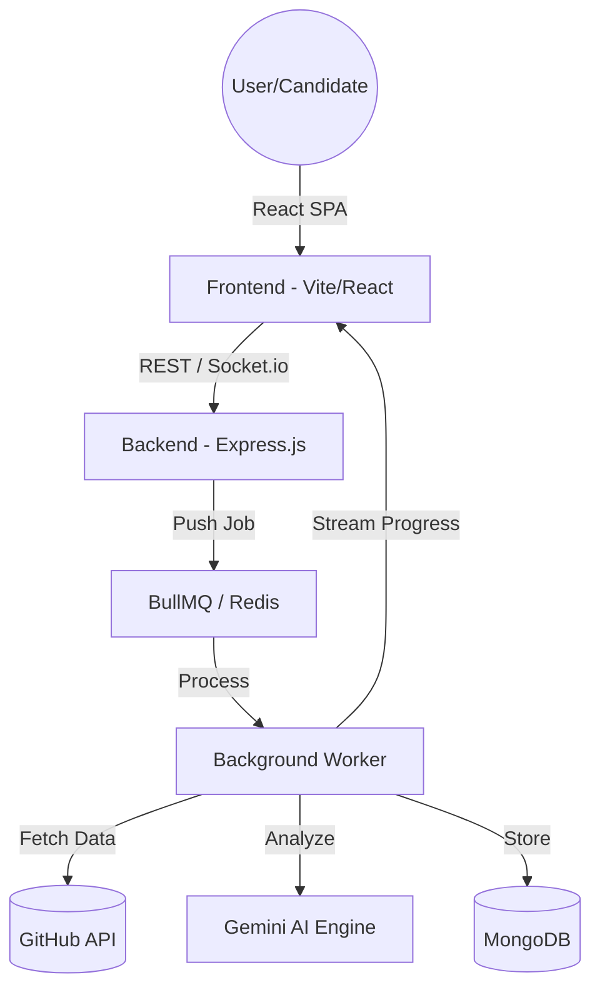
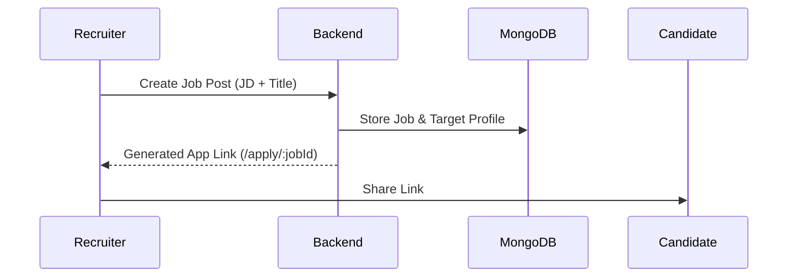
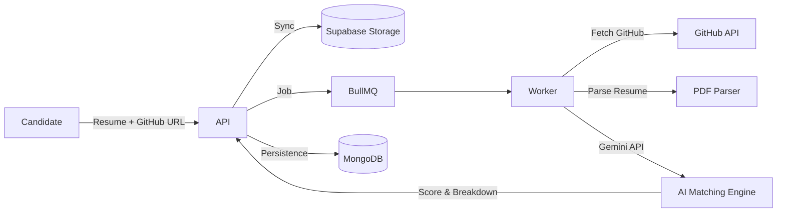

AnalyzeGit is a high-performance auditing system designed to evaluate GitHub repositories and developer personas using AI-driven heuristic analysis. It now includes a full **Recruitment Suite** for AI-powered candidate screening.

---

## 📖 User Walkthrough

Whether you are a developer looking to audit your code or a recruiter building a high-impact team, here is how you can get started:

### 1. For Developers (Instant Repository Audit)
*   **Paste your URL**: Simply drop any GitHub repository or profile link into the main search bar on the dashboard.
*   **Analyze in Real-Time**: Click **Analyze** and watch the AI work through stages like "Architectural Mapping" and "Code Quality Heuristics."
*   **Get Deep Insights**: Receive a professional-grade audit report featuring technical scoring, strength assessments, and actionable improvement points.

### 2. For Recruiters (Smart AI Hiring)
*   **Create a Job Post**: Use the **"New Job"** button to define your role's requirements and target technical profile.
*   **Share the Link**: Once published, copy the unique **Application Link** and share it with potential candidates via LinkedIn, email, or job boards.
*   **Review Ranked Matches**: Check your **Recruiter Console** to see candidates automatically ranked by how well their real-world GitHub performance matches your job requirements.

### 3. For Candidates (Evidence-Based Applying)
*   **Visit the Link**: Open the recruiter's shared application portal.
*   **Upload Your Identity**: Provide your basic details, a PDF resume, and your GitHub URL.
*   **Automated Persona Sync**: The system immediately begins syncing your GitHub activity with your application, allowing your actual code to speak for your skills.

---

## 🚀 How it Works

1.  **AI-Driven Heuristic Auditing**: Leverages **Gemini 2.5 Flash** to perform deep-dives into repository architecture, code quality, and developer impact through engineering-specific heuristics.
2.  **Event-Driven Real-Time Feedback**: Uses **Socket.io** to stream live analysis progress (e.g., "Parsing History", "Evaluating Performance") directly from background workers to the end-user.
3.  **Scalable Background Processing**: Implements a redundant **BullMQ & Redis** producer-consumer model, ensuring the main API remains responsive while tasks are offloaded to dedicated workers.
4.  **Integrated Recruitment Intelligence**: Automates candidate screening by cross-referencing uploaded resumes with live GitHub data to verify skills against real-world technical evidence.
5.  **Multilingual High-Fidelity UI**: Offers a fully localized experience (**English & Hindi**) wrapped in a premium, glassmorphism design system optimized for both desktop and mobile devices.

---

## 🏗️ System Architecture

The project follows a distributed, event-driven architecture designed for scalability and real-time user feedback.

---

## 💼 Recruitment Module (Hire Smarter)

AnalyzeGit enables recruiters to bridge the gap between resumes and real-world coding performance.

### 1. Recruiter Workflow
Recruiters can launch job posts and get a customized application portal link.

### 2. Candidate Application & AI Screening
When a candidate applies, the system performs a multi-stage persona audit.

---

## 🔄 Core Technical Workflows

### 1. Repository Audit Flow
1. **Submission**: User submits a GitHub URL. The API creates a unique `Job ID` and pushes a packet to the Redis queue.
2. **Buffering**: The worker picks up the job. The status is updated to `analyzing`.
3. **Execution**:
   - Worker fetches GitHub metadata using **Octokit**.
   - Data is summarized and sent to the **Gemini 2.5 Flash** with custom prompting.
   - Results are returned as structured JSON (Score, Summary, Strengths, Improvements).
4. **Real-time Engine**: Progress is streamed via **Socket.io** (10% -> 40% -> 90% -> Complete).

### 2. AI Recruitment Engine
The system uses a sophisticated prompt-chaining technique to evaluate candidates:
- **Resume Parsing**: Extracting core skills and experience from uploaded documents.
- **Git Persona Audit**: Evaluating commit frequency, technical diversity, and project impact on GitHub.
- **Cross-Referencing**: Matching the extracted persona against the recruiter's specific Job Description.

---

## 🛠️ Data Model & Tech Stack

### Frontend
- **React 18** + **Vite**
- **Framer Motion**: Premium glassmorphism animations.
- **Lucide React**: High-fidelity iconography.
- **TailwindCSS**: Utilitiy-first styling.
- **i18next**: Full Multilingual support (English/Hindi).

### Backend
- **Node.js / Express**: Modular API structure.
- **Socket.io**: Real-time event streaming.
- **BullMQ**: Reliable background job processing with Redis.
- **Gemini API**: Core AI reasoning engine.
- **MongoDB**: Persistent history and job storage.

---

## 🔌 API & Integration Points
- **Gemini 2.5 Flash**: Core reasoning and matching engine.
- **GitHub REST API**: Source of truth for developer performance.
- **jsPDF-autotable**: Dynamic PDF generation for audit reports.
- **React-Hot-Toast**: Real-time snackbar notifications.
